## This is the code release for the paper [Consistent Video-to-Video Transfer Using Synthetic Dataset](https://arxiv.org/abs/2311.00213).

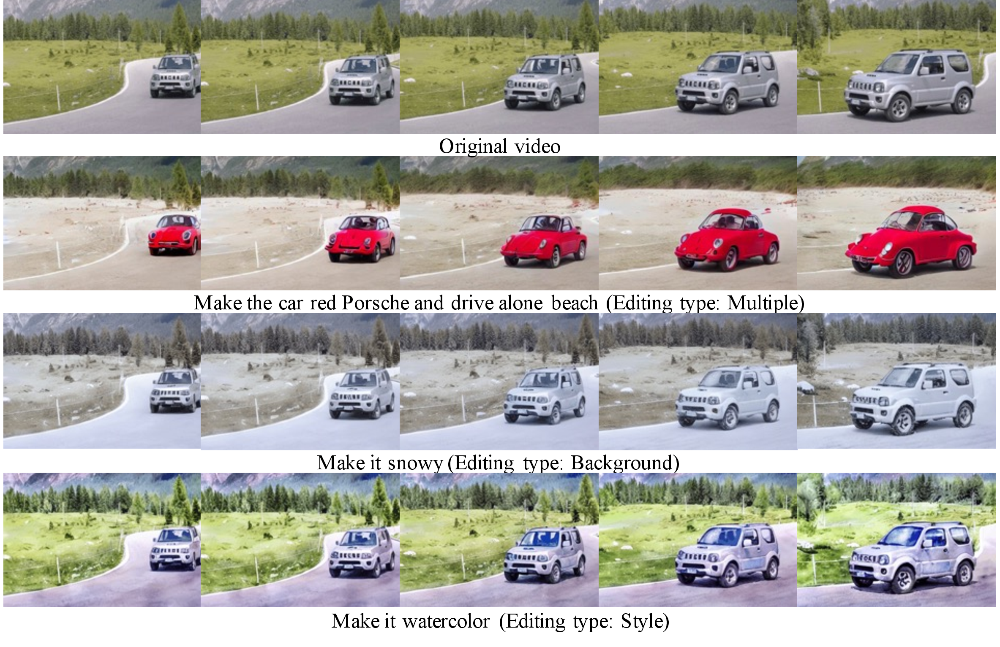

## Quick Links
* [Installation](#installation)
* [Video Editing](#video-editing) 🔥
* [Synthetic Video Prompt-to-Prompt Dataset](#synthetic-video-prompt-to-prompt-dataset)
* [Training](#training)
* [Create Synthetic Video Dataset](#create-synthetic-video-dataset)

## Updates
* 2023/11/29: We have updated paper with more comparison to recent baseline methods and updated the [comparison video](#visual-comparison-to-other-methods). Gradio demo code is uploaded, model still under release process.

## Installation
```bash
git clone [this repository]
pip install -r requirements.txt
```
NOTE: The code is tested on PyTorch 2.1.0+cu11.8 and corresponding xformers version. Any PyTorch version > 2.0 should work but please install the right corresponding xformers version.
## Video Editing
We are undergoing the model release process. Please stay tuned.

Download the [InsV2V model weights (To be released)]() and change the ckpt path in the following notebook.

✨🚀 This [notebook](video_edit.ipynb) provide a sample code to conduct text-based video editing.

### Download LOVEU Dataset for Testing
Please follow the instructions in the [LOVEU Dataset](https://sites.google.com/view/loveucvpr23/track4) to download the dataset. Use the following [script](insv2v_run_loveu_tgve.py) to run editing on the LOVEU dataset:
```bash
python insv2v_run_loveu_tgve.py \
    --config configs/instruct_v2v.yaml \
    --ckpt-path [PATH TO THE CHECKPOINT] \
    --data-dir [PATH TO THE LOVEU DATASET] \
    --with_optical_flow \ # use motion compensation
    --text-cfg 7.5 10 \
    --video-cfg 1.2 1.5 \
    --image-size 256 384
```
Note: you may need to try different combination of image resolution, video/text classifier free guidance scale to find the best editing results.

Example results of editing LOVEU-TGVE Dataset:


<table>
  <tr>
    <td>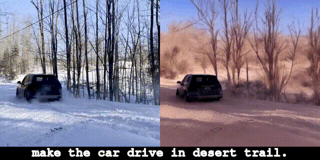</td>
    <td></td>
  </tr>
  <tr>
    <td>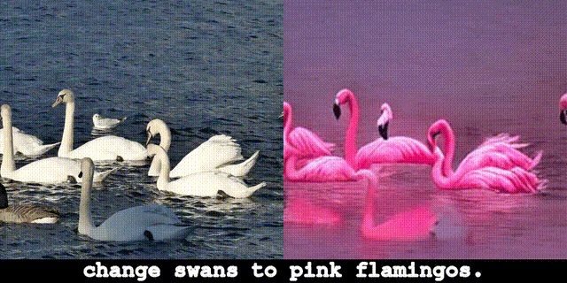</td>
    <td>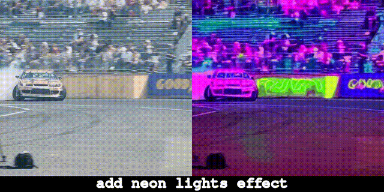</td>
  </tr>
  <tr>
    <td>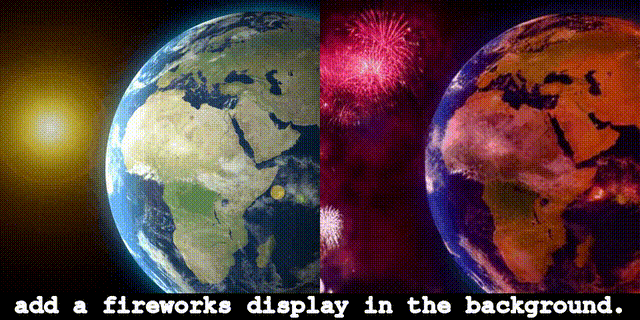</td>
    <td></td>
  </tr>
  <tr>
    <td>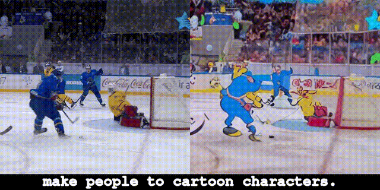</td>
    <td>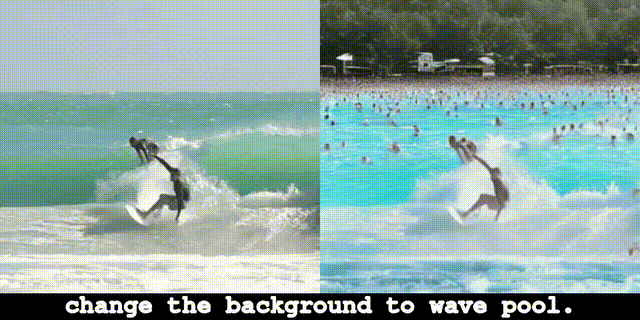</td>
  </tr>
  <tr>
    <td>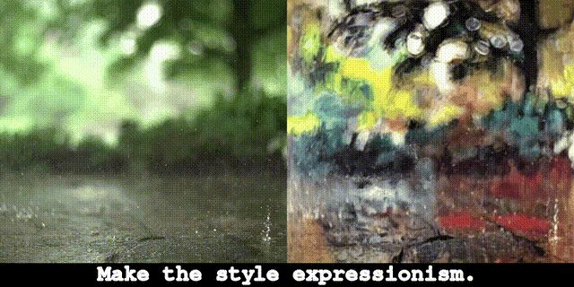</td>
    <td></td>
  </tr>
</table>


## Synthetic Video Prompt-to-Prompt Dataset

Generation pipeline of the synthetic video dataset:
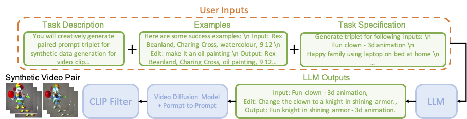

Examples of the synthetic video dataset:
<table>
  <tr>
    <td>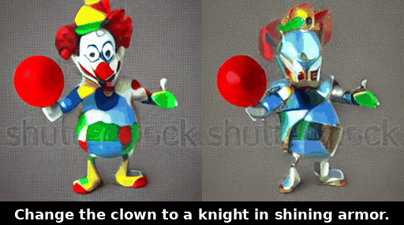</td>
    <td>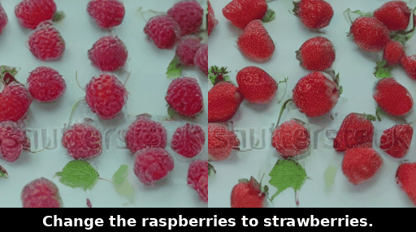</td>
  </tr>
  <tr>
    <td>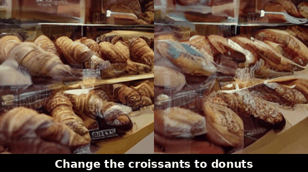</td>
    <td>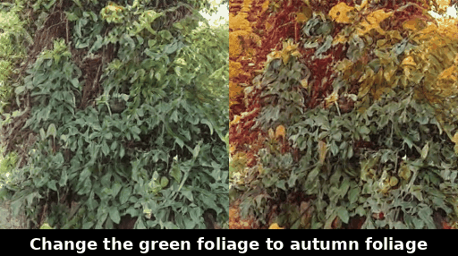</td>
  </tr>
  <tr>
    <td>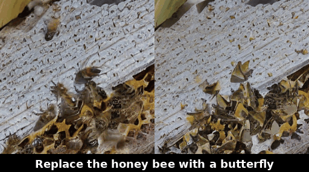</td>
    <td>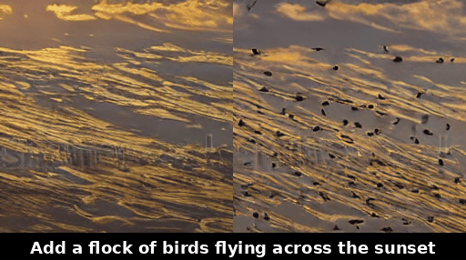</td>
  </tr>
  <tr>
    <td>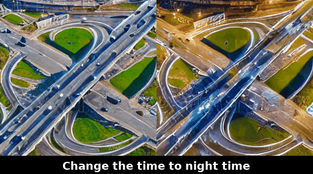</td>
    <td>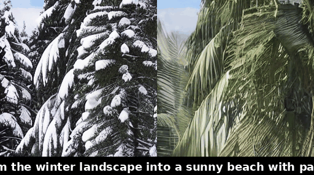</td>
  </tr>
  <tr>
    <td>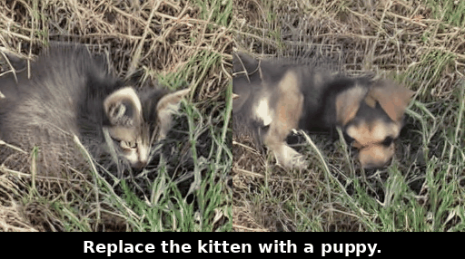</td>
    <td>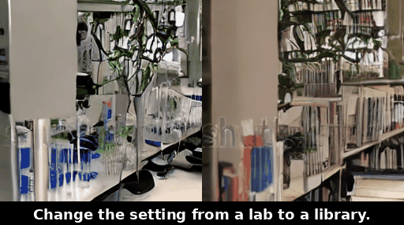</td>
  </tr>
</table>

## Training

### Download Foundational Models
[Download](https://drive.google.com/file/d/1R9sWsnGZUa5P8IB5DDfD9eU-T9SQLsFw/view?usp=sharing) the foundational models and place them in the `pretrained_models` folder.

### Download Synthetic Video Dataset
We are still undergoing the dataset release process. Please stay tuned. 
[To be released]()

### Train the Model
Put the synthetic video dataset in the `video_ptp` folder.

Run the following command to train the model:
```bash
python main.py --config configs/instruct_v2v.yaml -r # add -r to resume training if the training is interrupted
```

## Create Synthetic Video Dataset
If you want to create your own synthetic video dataset, please follow the instructions
* Download the modelscope VAE, UNet and text encoder weights from [here](https://huggingface.co/damo-vilab/modelscope-damo-text-to-video-synthesis/tree/main)
* Replace the model path in the [`video_prompt_to_prompt.py`](video_prompt_to_prompt.py) file
```
vae_ckpt = 'VAE_PATH'
unet_ckpt = 'UNet_PATH'
text_model_ckpt = 'Text_MODEL_PATH'
```
* Download the edit prompt files from [Instruct Pix2Pix](https://github.com/timothybrooks/instruct-pix2pix). The prompt file should be `gpt-generated-prompts.jsonl`, and change the file path in the `video_prompt_to_prompt.py` accordingly. Or download the WebVid prompt edit file proposed in our paper from [To be released]().
* Run the command to generate the synthetic video dataset:
```bash
python video_prompt_to_prompt.py 
    --start [START INDEX] \
    --end [END INDEX] \
    --prompt_source [ip2p or webvid] \
    --num_sample_each_prompt [NUM SAMPLES FOR EACH PROMPT]
```

## Visual Comparison to Other Methods

<video src='figures/videos/TGVE_video_edit.mp4' width=512/>


Links to the baselines used in the video:

[Tune-A-Video](https://github.com/showlab/Tune-A-Video) | [Control Video](https://github.com/thu-ml/controlvideo) | [Vid2Vid Zero](https://github.com/baaivision/vid2vid-zero) | [Video P2P](https://github.com/ShaoTengLiu/Video-P2P)

[TokenFlow](https://github.com/omerbt/TokenFlow) | [Render A Video](https://github.com/williamyang1991/Rerender_A_Video) | [Pix2Video](https://github.com/duyguceylan/pix2video)

## Credit
The code was implemented by [Jiaxin Cheng](https://github.com/cplusx) during his internship at the AWS Shanghai Lablet.
## References
Part of the code and the foundational models are adapted from the following works:
* [Instruct Pix2Pix](https://github.com/timothybrooks/instruct-pix2pix)
* [AnimateDiff](https://github.com/guoyww/animatediff/)